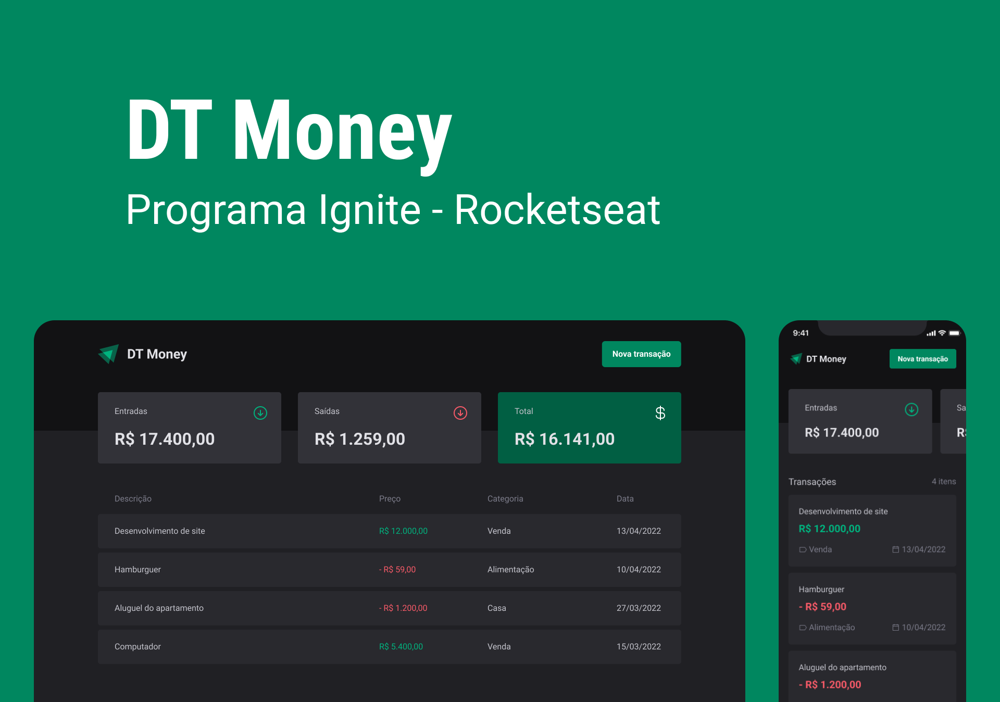

[ 🇧🇷 PT-BR ] 💲 ReactJS_DTMoney

<h3>🚀 Tecnologias utilizadas </h3>
<ul>
  <li> ReactJS </li>
  <li> TypeScript </li>
  <li> StyledComponents </li>
  <li> JSONServer </li>
  <li> Axios </li>
  
  
  
</ul>
<h3>ℹ️ Informações adicionais </h3>
<ul>
  <li>Projeto de controle financeiro focado em consumo de API (simulando utilizando JSONServer), acessibilidade e performance </li>
  <li>Para iniciar a API (JSONServer) executar o seguinte comando: <pre>npm run dev:server</pre></li>
 </ul>

[ 🇺🇸 ENG ] 💲 ReactJS_DTMoney

<h3>🚀 Technologies used </h3>
<ul>
  <li> ReactJS </li>
  <li> TypeScript </li>
   <li> StyledComponents </li>
  <li> JSONServer </li>
  <li> Axios </li>
</ul>
<h3>ℹ️ Additional Information </h3>
<ul>
  <li>Financial control project focused on API consumption (simulating using JSONServer), accessibility and performance</li>
  <li>To start the API (JSONServer) Run the following command:  <pre>npm run dev:server</pre></li>
 </ul>

<h3>Preview:</h3>

 

